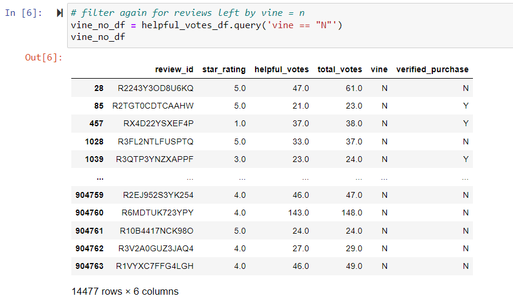
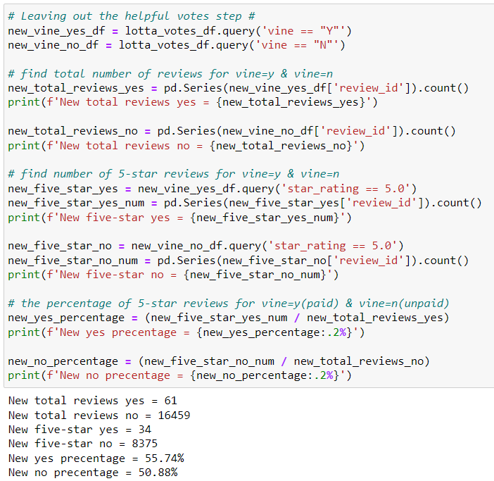

# Amazon-Vine-Analysis

## Overview of the analysis: 
This analysis looks at Amazon reviews written by members of the paid Amazon Vine Program. Companies that sell their products on Amazon pay a fee and provide products to Vine members who are obligated to then publish a review of the product. The aim of this project is to see if there is any bias toward favorable reviews from Vine members. Please Note: The data was previously cleaned.

## Results: 

- How many Vine reviews and non-Vine reviews were there?

  - 

  - *Note: To find the total reviews, we first filtered the data set for reviews with more than 20 votes and where helpful_votes were atleast half of those votes.*

  - The image above shows the dataframe for non-Vine reviews has 14,477 reviews, while the one for vine reviews has 60.

- How many Vine reviews were 5 stars? How many non-Vine reviews were 5 stars?

  - Vine reviews with 5 stars: 34
  - Non-Vine reviews with 5 stars: 8,212

- What percentage of Vine reviews were 5 stars? What percentage of non-Vine reviews were 5 stars?

  - Percentage of Vines that were 5-star: 56.67%
  - Percentage of non-Vines that were 5-star: 56.72%

## Summary: 

Because the aim of this project is to see if there is any bias toward favorable reviews from Vine members, the percentages of 5-star reviews should be compared. Non-Vine reviews actually had a 0.05 higher percentage than Vine reviews, meaning there was not a bias. Although the percentages were close, we are working with the assumption that our filtering process did not affect the results. Reviews voted helpful by at least 50% of voters are probably bias themselves. Let us redo the analysis by skipping the helpful step so that the only way the data has been filtered is by reviews that have over 20 votes.

Vine reviews had a 4.86% higher percentage than non-Vine reviews, meaning there may be bias toward favorable reviews from Vine reviewers! That is a signifact different from the numbers we saw before. This could mean that the public may have caught onto this bias and tends not to vote those reviews as helpful, but a more in depth analysis on why voters vote the way they do is needed.

*Note: The way the code is written may seem odd or indirect, but this is because calling the columns in any way always resulted in a KeyError (as did using the .loc function), so I had to get creative.*